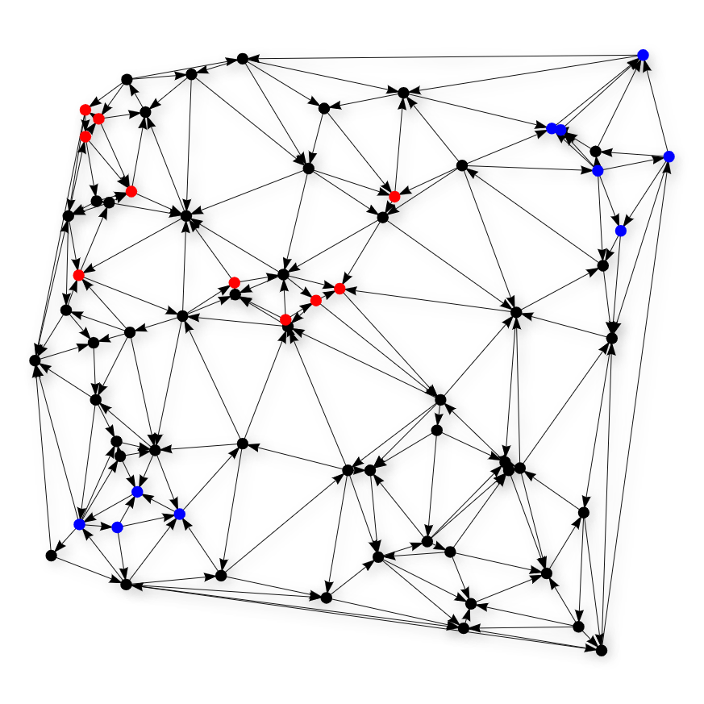
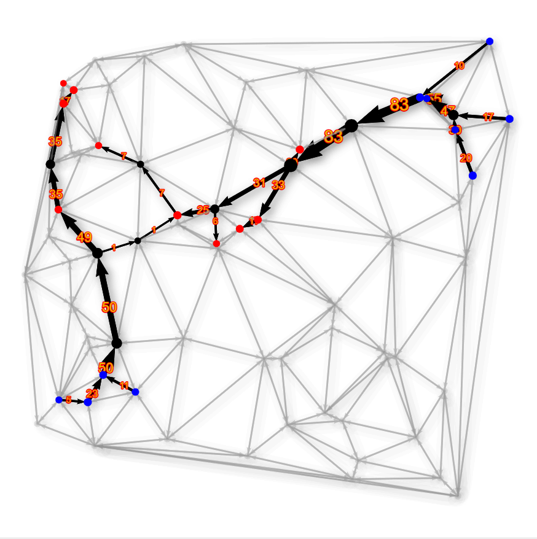

# FCNF-Solver
## Dalton Gomez

FCNF-Solver is a sandbox codebase for the NP-Hard *Fixed Charge Network Flow Problem* (FCNF).

## Problem Description
FCNF is a network design problem that optimizes the topology and routing of a commodity over an input graph, returning 
the flow network solution as output. The input is comprised of a target demand (i.e. total amount of flow the output 
network must realize) and an undirected graph of nodes and edges. Each node is identified as either a source, sink, or 
intermediate node, making FCNF a specific type of the transshipment problem. Each edge in the graph has a capacity 
(i.e. max flow it can be assigned), a variable cost (i.e. a cost paid per unit of flow assigned to the edge), and a 
fixed cost (i.e. an all-or-nothing cost paid if any amount of flow is assigned to the edge). FCNF is an optimization 
problem that minimizes the total cost of the network, subject to meeting the target demand, abiding by the capacity 
constraints of the edges, and maintaining conservation of flow from source to sink. FCNF is formulated as a 
mixed-integer linear program (MILP) below:

**Compute:**

$$ \min \sum_{e_{ij} \in E} v_{ij} q_{ij} + f_{ij} y_{ij} $$

**Subject to:**

1) $$ y_{ij} \in \lbrace 0,1 \rbrace, \quad \forall e_{ij} \in E $$

2) $$ \sum_{i \in T} t_i \geq d, \quad \forall i \in T $$

3) $$ 0 \leq q_{ij} \leq c_{ij} y_{ij}, \quad \forall e_{ij} \in E $$

4) $$ \sum_{j:e_{ij} \in E} q_{ij}-\sum_{j:e_{ji} \in E} q_{ji} =
      \begin{cases}
          s_j, \quad \text{if}\ j \in S\\
          -t_j, \quad \text{if}\ j \in T\\
          0, \quad \text{otherwise}\\
      \end{cases} 
    , \quad \forall j \in N $$

In this formulation, $N$ represents the set of all nodes, $S$ is the set of all sources, and $T$ is the set of all 
sinks. $s_i$ and $t_i$ are the assigned flows produced or consumed at source or sink $i$, respectively. $E$ is the set 
of all edges, where edge $e_{ij}$ spans from node $i$ to node $j$. (Note that, since the input graph is undirected, the 
edge $e_{ij}$ implies an edge $e_{ji}$.) For each edge $e_{ij}$ in $E$, $v_{ij}$ is the variable cost of the edge, 
$f_{ij}$ is the fixed cost of the edge, and $c_{ij}$ is the capacity of the edge. These values are set by the input 
graph to be solved. The decision variables of FCNF are $q_{ij}$, the amount of flow in $\mathbb{R}^+$ assigned to edge 
$e_{ij}$, and $y_{ij}$, the binary decision to open edge $e_{ij}$ and pay the full fixed cost. Constraint #1 forces
$y_{ij}$ to be binary and, therefore, discretizes the search space, causing this formulation to be a MILP. $d$ is the 
target demand of the network set by the user, which is enforced by Constraint #2. Constraint #3 ensures that an edge is 
opened before it can be used and that no edge exceeds its capacity. Constraint #4 maintains conservation of flow by 
allowing only sources to produce flow, sinks to consume flow, and intermediate nodes to transport flow. Lastly, the 
objective function minimizes the total cost of the returned flow network.

The returned output of the above optimization problem is the set of directed edges used and the amount of flow assigned 
to each used edge. In this sense, FCNF allows us to model "from-scratch" transportation infrastructure as the act of 
opening an edge (i.e. paying the full fixed cost) represents the construction of the infrastructure and the act of 
assigning flow to each edge (i.e. paying the variable cost proportional to the use) represents the operation and 
maintenance of the infrastructure. FCNF, therefore, provides a useful abstraction that disregards the physical commodity
being transported. Applications of FCNF vary, including cars on roads, water in pipes, and data in broadband networks.
The specific use case motivating this repository is carbon capture and storage infrastructure, which is widely proposed 
but often not yet realized by constructed, operating systems. Additionally, several generalizations of FCNF exist. 
Source and sink nodes can take on their own capacities and/or costs, resulting in Source/Sink-Capacitated FCNF and 
Source/Sink-Charged FCNF, respectively. By allowing a discrete number of parallel arcs per edge, where each arc has its 
own capacity and costs, the problem becomes the Parallel-Arc FCNF. These generalizations expand the modeling 
capabilities of the problem.

**For a comprehensive review on the Fixed-Charge Network Flow Problem, see:**         
Crainic, T. G., Gendreau, M., & Gendron, B. (Eds.). (2021). 
[*Network Design with Applications to Transportation and Logistics*](https://link.springer.com/book/10.1007/978-3-030-64018-7). 
Springer.

## Repo Overview

### Functionality

The following functionality is provided in this repository. Note that specific dependencies are required (see below).

#### 1. FCNF Input Object, Generator & Visualizer

An object of the [CandidateGraph](src/Graph/CandidateGraph.py) class stores an input graph instance of FCNF. Several 
test instances are saved, in a binary (i.e. "pickled") form, in the [graph_instances](data/graph_instances) directory. 
An input graph instance is composed of node and arc objects and additional data. New graph instances can be created via 
an object of the [GraphGenerator](src/Graph/GraphGenerator.py) class, which uses a pseudo-random clustering technique 
to generate graph instances. This technique is inspired by real-world carbon capture and storage candidate 
infrastructure that often has clusters of sources (i.e. point-source carbon emitters) and sinks 
(i.e. geologic carbon sinks). In this method, $n - (s+t)$ points, representing the intermediate nodes, are embedded in 
$\mathbb{R}^2$ in a uniform random manner. Then a set number of source clusters and sink clusters are generated, each 
with a bounded but random number of nodes and location within a cluster radius. Any remaining sources and sinks are 
placed in a true uniform random manner. Edges are then generated via a Delaunay triangulation of the placed nodes in 
$\mathbb{R}^2$. Each edge is assigned a bounded, random penalty factor, and the fixed and variable costs are calculated 
based on this penalty factor, the edge's Euclidean distance, and a look-up table of cost scalars. If multiple capacities 
are given in this look-up table, each edge will be modeled as multiple parallel arcs, each with their own costs and 
capacity. Finally, an object of the [GraphVisualizer](src/Graph/GraphVisualizer.py) class allows for customizable 
visualizations of the graph instances, rendered as HTML files using PyVis, a wrapper of jsVis.

#### 2. MILP Solver for FCNF

The [MILPsolverCPLEX](src/Solvers/MILPsolverCPLEX.py) class calls IBM's ILOG CPLEX mathematical programming solver to 
eventually find an optimal solution to the input FCNF instance. (Note that this functionality requires a local 
installation of CPLEX v.20.) The optimality of the eventual solution is guaranteed by branch-and-bound enumeration of 
the search space. Solutions found can then be written to an object of the
[FlowNetworkSolution](src/FlowNetwork/FlowNetworkSolution.py) class by the MILP solver object. Objects of the 
FlowNetworkSolution class can also be visualized by instantiating the 
[SolutionVisualizer](src/FlowNetwork/SolutionVisualizer.py) class.

#### 3. Metahueristic Approaches to FCNF

*While code is available in the repo for this functionality, it is currently under active research/development. As 
such, no description is given at this time. Stay tuned!*

### Project Dependencies

* Python 3.8 *(latest version compatible with docplex)*
* [CPLEX 20.0+](https://www.ibm.com/analytics/cplex-optimizer) *(local installation)*
* [docplex](https://ibmdecisionoptimization.github.io/docplex-doc/)
* [PyVis](https://pyvis.readthedocs.io/en/latest/index.html)
* [Numpy](https://numpy.org/)
* [MatPlotLib](https://matplotlib.org/)
* [SciPy](https://scipy.org/)

### Tests

*Unit and integration tests coming soon!*
